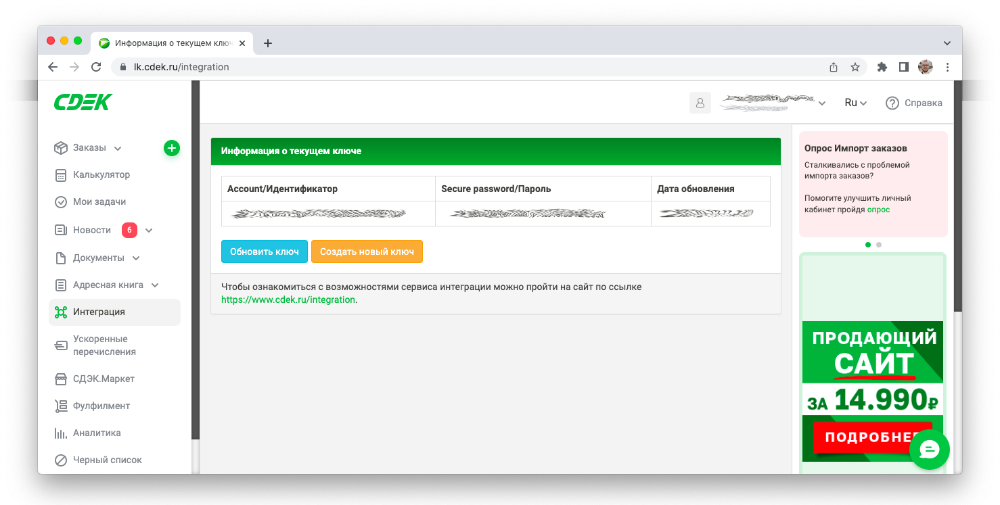

# Pycdek
CDEK API v2.0 will be implemented (https://api-docs.cdek.ru/29923741.html)


## Installation

```
git clone https://github.com/andreyvolobuev/pycdek
cd pycdek
python3 setup.py
```


## Example

1. Get your CLIENT_ID and CLIENT_SECRET [here](https://lk.cdek.ru/integration): 




```
from pycdek import CDEK


CLIENT_ID = '................................'
CLIENT_SECRET = '................................'

cdek = CDEK(CLIENT_ID, CLIENT_SECRET)

moscow = cdek.get_cities(city="Москва")
from_location = cdek.get_location("Тверская 1", moscow[0])

vladivostok = cdek.get_cities(city="Владивосток")
to_location = cdek.get_location("Светланская 1", vladivostok[1])

package = cdek.create_package(name="Подарок", weight=1)

tariffs = cdek.get_available_tariffs(
    from_location=from_location, to_location=to_location, packages=[package]
)
tariff = tariffs.fastest

sender = cdek.get_contact(name="Иванов Иван Иванович", phones=["+79111111111"])
recipient = cdek.get_contact(name="Петров Петр Петрович", phones=["+79222222222"])

order = cdek.register_order(
    tariff=tariff,
    from_location=from_location,
    to_location=to_location,
    packages=[package],
    sender=sender,
    recipient=recipient
)
```


## Testing

```
python3 -m unittest
```
